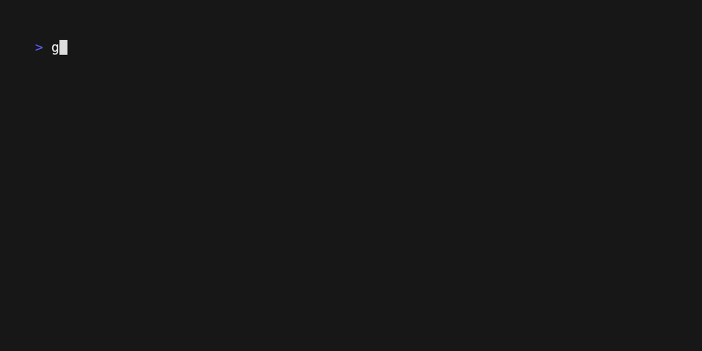

# Todo list (CLI)

## Instructions

Starting with the [shopping list tutorial by bubbletea](https://github.com/charmbracelet/bubbletea/tree/master/tutorials/basics),
make a simple persisted todo list in the console.



## Usage

```shell
# go get github.com/charmbracelet/bubbletea
# go get github.com/charmbracelet/bubbles/help
# go get github.com/charmbracelet/bubbles/textinput

go run cli-todolist/main.go
```
